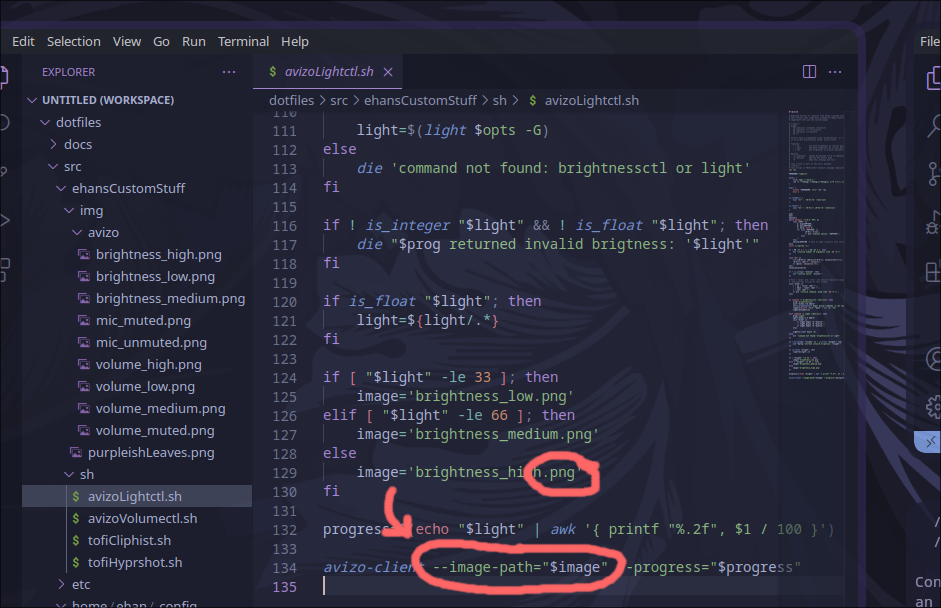
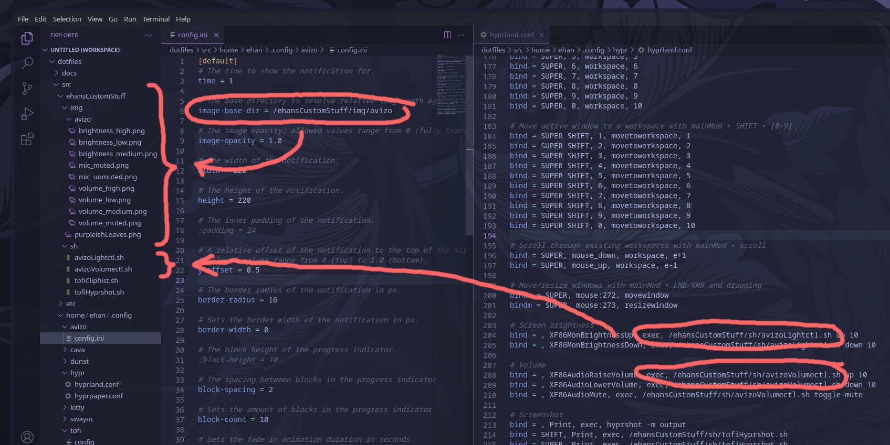

# OSD

On-screen-display (aka OSD) is the volume or brightness or anything "pop-up"/indicator most DEs have.

I use avizo, https://github.com/misterdanb/avizo, it's package is `avizo` (AUR)

## Custom images in avizo

Avizo's `volumectl` and `lightctl` commands use `--image-resource`, instead of `--image-path`. So even if you set `--image-base-dir` in your config, it won't use your images, because its using the image resources that come with avizo, not the image path from the config's image directory. 

To fix this, I made a copy of `volumectl` and `lightctl`, and modified them to use `--image-path` and have a file extension at the end of the variable's value (in my case `.png`) 

After making a modified version of `volumectl` and `lightctl`, I set the image directory in the config file and changed any script than runs `volumectl` or `lightctl` to run my modified scripts instead.

Now, it works perfectly!

